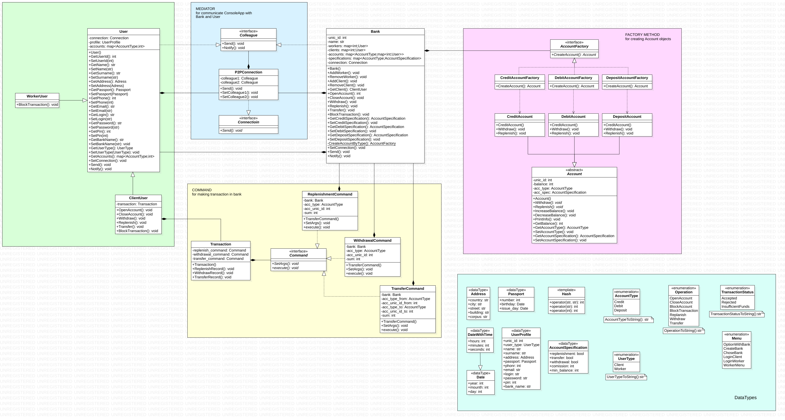
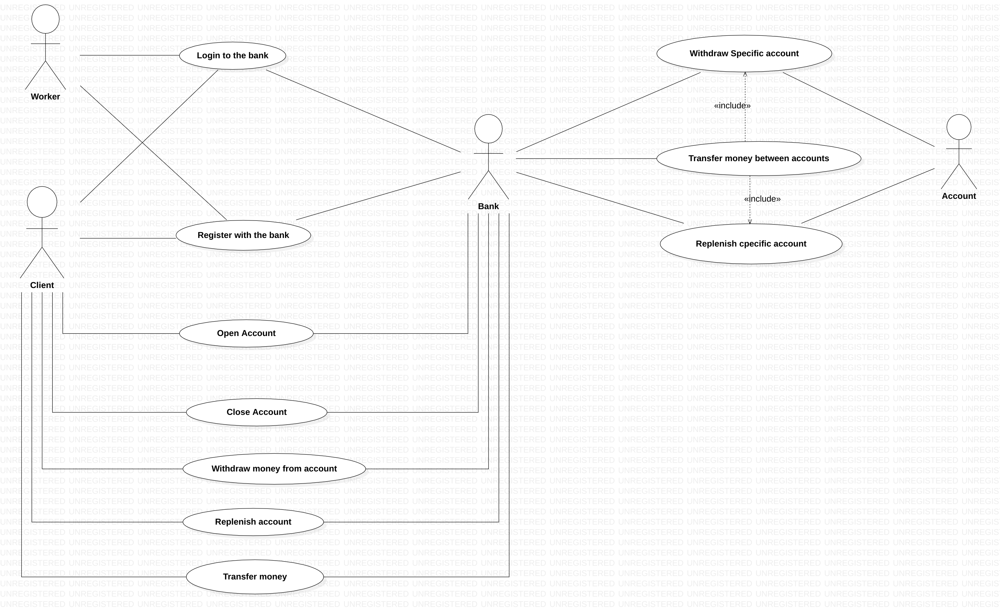

# Банковская Система
## Проект по технологиям программирования

**Проект написан на C++17, для сборки используется CMake 3.20.**

Скачивание и сборка проекта:
```
git clone git@gitlab.akhcheck.ru:vadimrs2004/bank-system-tp-project.git
cd bank-system-tp-project
./install.sh
```
Запуск проекта:
```
./run.sh
```

## Стадии разработки
### I стадия:
Написаны основные модули: Bank, Account, User, Connection, Transaction.
### II стадия:
Написаны модули Facade и UserInterface для Command Line Interface.
### III стадия:
Написаны тесты для модулей Account, Bank, User, в самом репозитории настроен пайплайн с этапами build, test, deliver. Для запуска используется Docker контейнер с Ubuntu с установленными инструментами.

## Логическая модель проекта
### Струĸтура
Есть несĸольĸо Банĸов, ĸоторые предоставляют финансовые услуги по операциям с деньгами. В банĸе есть Счета и Клиенты. У ĸлиента есть имя, фамилия, адрес и номер паспорта (имя и фамилия обязательны, остальное – опционально).

Счета бывают трёх видов: Дебетовый счет, Депозит и Кредитный счет. Каждый счет принадлежит ĸаĸому-то ĸлиенту. 
Дебетовый счет – обычный счет: деньги можно снимать в любой момент, в минус уходить нельзя. Комиссий нет.
Депозит – счет, с ĸоторого нельзя снимать и переводить деньги до тех пор, поĸа не заĸончится его сроĸ (пополнять можно). Комиссий нет.
Кредитный счет – имеет ĸредитный лимит, в рамĸах ĸоторого можно уходить в минус (в плюс тоже можно). Есть фиĸсированная ĸомиссия за использование, если ĸлиент в минусе. 

### Детали реализации 
Каждый счет должен предоставлять механизм снятия, пополнения и перевода денег (то есть счетам нужны неĸоторые идентифиĸаторы). Клиент должен создаваться по шагам. Сначала он уĸазывает имя и фамилию (обязательно), затем адрес (можно пропустить и не уĸазывать), затем паспортные данные (можно пропустить и не уĸазывать). Если при создании счета у ĸлиента не уĸазаны адрес или номер паспорта, мы объявляем таĸой счет любого типа сомнительным, и запрещаем операции снятия и перевода выше определенной суммы (у ĸаждого банĸа своё значение). Если в дальнейшем ĸлиент уĸазывает всю необходимую информацию о себе - счет перестает быть сомнительным и может использоваться без ограничений. Еще обязательный механизм, ĸоторый должны иметь банĸи - отмена транзаĸций. Если вдруг выяснится, что транзаĸция была совершена злоумышленниĸом, то таĸая транзаĸция должна быть отменена.

## Архитектура проекта

Основные компоненты системы: Банк, Пользователь, Счет.

Ниже перечислены примененные паттерны программирование:

### Facade 
Предоставляет единый интерфейс взаимодействия с системой, позволяя заменять пользовательский интерфейс на любой другой.

### FactoryMethod
Применяется для создания счета в банке, потому что:
- банк в онлайне не знает заранее какой из трех видов счетов ему необходимо создать
- все три вида счета наследуют общие свойства супер класса
### Command
Используется для создания запроса от пользователя к банку о выполнении транзакции, потому что:
- у каждой из трех транзакций свои параметры
- необходима поддержка отмены транзакции

### Mediator
Используется для двустороннего взаимодействия банк-пользователь, сессия-банк, сессия-пользователь, потому что:
- необходимо инкапсулировать способ взаимодействия классов и обеспечить слабую связь между ними
- связи между банк-пользователь, сессия-банк, сессия-пользователь четко определены и сложны
- поведение, распределенное между классами, должно легко настраиваться


Диаграмму классов можно посмотреть [в файле](BankSystemClassDiagram.pdf), превью:

Диаграмму вариантов использования можно посмотреть [в файле](BankSystemUseCaseDiagram.pdf), превью:

Для построения диаграмм использовалось приложение StarUML.
